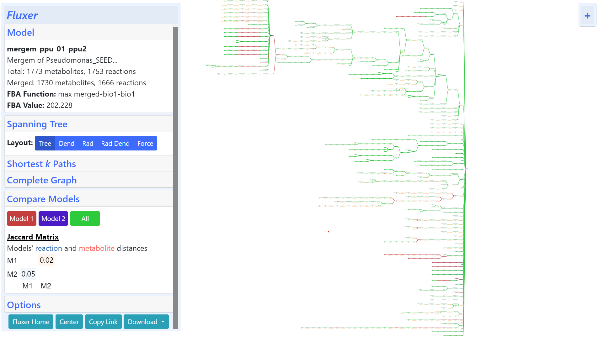
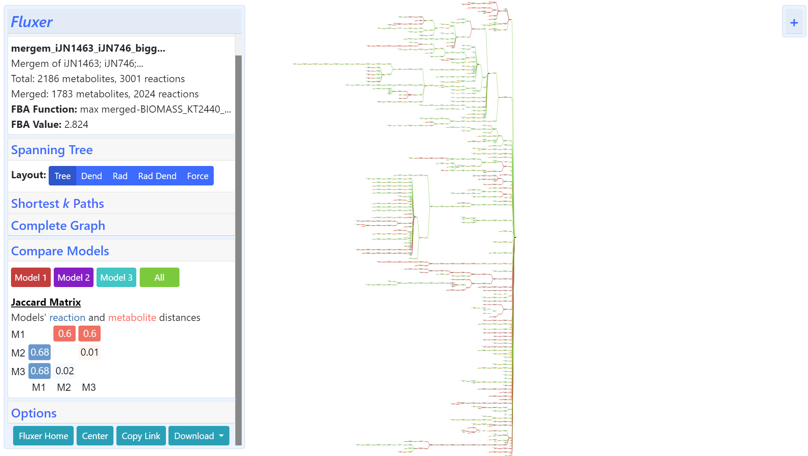

**********************************
Use examples
**********************************

Running on Command-line
========================================

Merging reconstructions built using different templates
--------------------------------------------------------------------------------
To compare the effect of reconstruction parameters, we merged two P. putida draft
reconstructions built on ModelSEED using either a gram-positive or core template.

::

    mergem -v MS1_PPU.sbml MS2_PPU.sml -o MS1_MS2_merged_PPU.xml

Results from merging the two reconstructions on the command-line using mergem are
shown below.

.. code-block:: none

    Merging models complete. Merged model saved as MS1_MS2_merged_PPU.xml
    Jaccard distance matrix: [[0, 0.02425267907501405], [0.049657534246575374, 0]]
    Metabolites merged: 1730
    Reactions merged: 1666

The figure below shows the same merging on the web-application Fluxer and can be
accessed `here <https://fluxer.umbc.edu/model?id=7fe8a8e65427f5f30412cc3341b5ec596e956f42_8483528fcd5891b944d53a6e4f61214acb596f42_obj_merge>`_.

Importing Python package
========================================

Studying model versions
---------------------------

Different versions of models can be compared to analyze elements that were added or removed during update.
The results of comparing three versions of a P. putida KT2400 model using mergem on the Python console are
shown below:

::

    import mergem

    input_models_list = ['models/iJN1463.xml', 'models/iJN746.xml', 'models/MNX_iJN746.sbml']
    merge_results = mergem.merge(input_models_list, set_objective='merge')

    print('Number of metabolites in merged model: ', len(merge_results['merged_model'].metabolites))
    print('Number of reactions in merged model: ', len(merge_results['merged_model'].reactions))

    print("Jaccard matrix: \n", merge_results['jacc_matrix'])

    print('Number of metabolites merged between input models: ', merge_results['num_met_merged'])
    print('Number of reactions merged between input models: ', merge_results['num_reac_merged'])

Running the above script produces the following output:

::

    Number of metabolites in merged model:  2186
    Number of reactions in merged model:  3001
    Jaccard matrix:
    [[0, 0.5976168652612283, 0.5986270022883295], [0.6765588529509836, 0, 0.00658616904500553], [0.679, 0.01526717557251911, 0]]
    Number of metabolites merged between input models:  1783
    Number of reactions merged between input models:  2024

The same result including the Jaccard matrix can be visualized on Fluxer as shown below:

The above Fluxer result can be accessed `here <https://fluxer.umbc.edu/model?id=f4f30bd4265c5734d98b719ce39e0dbbd5d4ecfb_0bab56f8be08a3d62f24dd16c00b6b01fd85cb27_7fe25baa10e0f3ee212b5b8b4edc4742e5ebfd8b_obj_merge>`_.