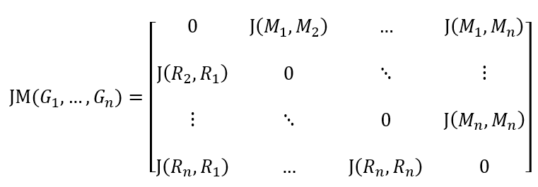

*******************************
Understanding mergem results
*******************************

Results from command-line execution
========================================

Saving merged model
--------------------

When no output filename and format is given, the command-line execution of mergem without any arguments produces a
.xml file containing the merged model in SBML format with filename that's a concatenation of the SBML model IDs of
input model files separated by an underscore "_". mergem uses COBRApy to save the merged model and thus can save
models in the SBML, JSON, and MATLAB formats.

To change the output filename and format, provide the :code:`-o` argument to the mergem command:

::

    mergem model1.xml model2.xml -o myfilename.xml

In the above example, mergem will save the merged model as :code:`myfilename.xml` in current working directory.

Printing merging statistics
------------------------------

To print statistics on the input models and the merging, enter the :code:`-v` argument:

::

    mergem model1.xml model2.xml -v

Once the models are merged, input model Jaccard distances and the number of metabolites and reactions merged are printed
to the console.

Jaccard distances are printed as a matrix with the metabolic and reaction Jaccard distances of pairs of input models.
The matrix follows the format shown below:

where :math:`J(M_i, M_j)` and :math:`J(R_i, R_j)` represent the metabolite and reaction Jaccard distances between models
:math:`i` and :math:`j`.

Statistics are printed in the format as shown in the example below:

::

    Jaccard distance matrix: [[0, 0], [0, 0]]
    Mets merged: 72
    Reacs merged: 94

In the above case, two models were merged. A Jaccard distance of 0 indicates close match with reference model.
Thus the two models are an exact match of each other.
The result also shows that 72 metabolites and 94 reactions were merged between the two
models.

Results from python package
=======================================

Merging models using the mergem package on a python script returns a dictionary of results including the merged model,
Jaccard distances, number of merged metabolites and reactions, and a dictionary containing the indices of input models
within which each metabolite and reaction were found.

::

    from mergem import merge

    merge_results = merge([model1, model2])

Individual results can be accessed using the dictionary keys :code:`merged_model` , :code:`jacc_matrix` ,
:code:`num_met_merged` , :code:`num_reac_merged` , :code:`met_sources` , and
:code:`reac_sources` as shown below:

::

    merged_model_obj = merge_results['merged_model']
    jaccard_distances = merge_results['jacc_matrix']
    num_mets_merged = merge_results['num_met_merged']
    num_reacs_merged = merge_results['num_reac_merged']
    metabolite_sources = merge_results['met_sources']
    reaction_sources = merge_results['reac_sources']

